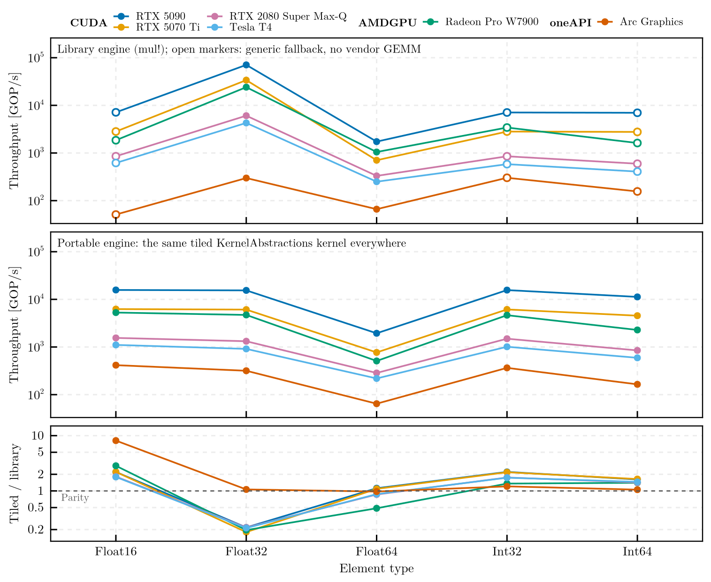
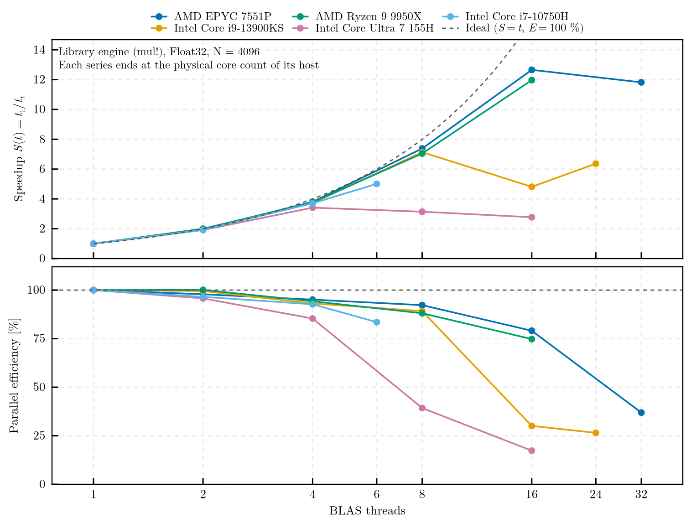

# scicomp-toolbox

[](https://github.com/PaulGoG/scicomp-toolbox/actions/workflows/ci.yml)
[](https://github.com/PaulGoG/scicomp-toolbox/actions/workflows/format.yml)
[](https://github.com/JuliaTesting/Aqua.jl)
[](https://github.com/aviatesk/JET.jl)
[](https://github.com/domluna/JuliaFormatter.jl)
[](https://julialang.org)
[](https://www.kernel.org)
[](LICENSE)

Scientific scripting workbench in Julia. It hosts standalone utilities and self-contained
tools that do not warrant a package of their own, behind one dispatcher, one test runner
and one formatting gate.



Output of `hardware-diagnostics` drawn by `plot-benchmarks`, pooled over the six runs in
[`reference-runs/`](reference-runs/): the same operation, D = A·B + A·C at N = 4096, on
six accelerators of three vendors, through the library path of each device and through
one tiled KernelAbstractions kernel compiled for all of them from the same source. Where
a tuned vendor GEMM exists the library keeps its lead — 4.6 to 5.5× at `Float32` on the
five discrete cards, parity on the Intel integrated GPU — and at `Float64`, whose rate is
capped by the hardware, the portable kernel comes within 15 % of it and passes it on both
consumer NVIDIA cards. Where `mul!` has no vendor GEMM and falls back to the generic
GPUArrays path, which is every integer type and `Float16`, the portable kernel leads by
1.05 to 8.1×.



The host side of the same six runs: five processors from six to 32 physical cores. Each
series ends at the physical core count of its host, and the shape of its tail is the
topology — the EPYC regresses past 16 threads across its four dies, while both hybrid
Intel parts lose efficiency as soon as the sweep spreads past their performance cores
(30 % at 16 threads for the i9-13900KS, 17 % at 16 for the Core Ultra 7 155H).

```bash
julia run.jl hardware-diagnostics --stress                   # one machine
julia run.jl plot-benchmarks --compare                       # both figures above
```

```
scicomp-toolbox/
├── .github/
│   ├── dependabot.yml             # weekly updates of actions and Julia environments
│   └── workflows/
│       ├── ci.yml                 # test suites, standalone and dispatcher smoke runs
│       └── format.yml             # JuliaFormatter gate using formatter/
├── .JuliaFormatter.toml           # formatting rules
├── CHANGELOG.md
├── LICENSE                        # MIT
├── README.md
├── check.jl                       # pre-commit: format with formatter/, then test.jl
├── assets/                        # figures used by this README
├── reference-runs/                # datasets of the six validation runs, one per accelerator
│   └── README.md                  # hardware, configuration and outcome of each run
├── run.jl                         # dispatcher: list, run and scaffold tools
├── test.jl                        # global test runner
├── formatter/                     # pinned JuliaFormatter environment (Project + Manifest)
│   └── activate.jl
├── standalone/                    # tier 2: single-file scripts on the standard library
│   └── sysinfo.jl                 # host and runtime introspection
├── hardware-diagnostics/          # tier 1: HardwareDiagnostics package with GPU extensions
│   ├── activate.jl
│   ├── config.toml
│   ├── hardware-diagnostics.jl    # entry point
│   ├── Manifest.toml
│   ├── Project.toml
│   ├── README.md
│   ├── ext/                       # HardwareDiagnostics{CUDA,AMDGPU,Metal,oneAPI}Ext
│   ├── src/
│   └── test/
└── plot-benchmarks/               # tier 1: figures from hardware-diagnostics datasets
    ├── activate.jl
    ├── config.toml
    ├── plot-benchmarks.jl         # entry point
    ├── Manifest.toml
    ├── Project.toml
    ├── README.md
    └── test/
```

## Two tiers

A **tier 1 tool** is a directory with its own `Project.toml` and committed `Manifest.toml`,
an `activate.jl`, a validated `config.toml`, the entry point `<name>/<name>.jl`, a test
suite under `test/` and a README. A tool that outgrows a script becomes a package inside
that directory (`name` and `uuid` in `Project.toml`, `src/<Name>.jl`); the dispatcher and
the test runner handle both forms. Tools never share an environment, so their
dependencies cannot conflict.

A **tier 2 script** in `standalone/` relies on the standard library only and runs without
instantiation.

## Requirements

Julia 1.12 or later through [juliaup](https://github.com/JuliaLang/juliaup); the declared
floor of every environment is `julia = "1.12"` and the committed manifests are resolved
with the current stable release (1.13). Linux is the primary platform. GPU packages
(`CUDA`, `AMDGPU`, `Metal`, `oneAPI`) are not dependencies of any tool: install the one
matching the hardware into the default environment and the tool resolves it through the
load path (see `hardware-diagnostics/README.md`).

## Entry points

```bash
julia run.jl --list                                     # catalog
julia run.jl sysinfo                                    # standalone script
julia run.jl hardware-diagnostics --quick --cpu-only    # tool; arguments are forwarded
julia run.jl plot-benchmarks --format png               # figures from the newest dataset
julia run.jl plot-benchmarks --compare                  # cross-host figures from reference-runs/
julia run.jl --threads 8 hardware-diagnostics           # Julia threads of the child process
julia run.jl --new <name>                               # scaffold a tier 1 tool
julia test.jl                                           # every test suite
julia test.jl hardware-diagnostics                      # one suite
julia check.jl                                          # format in place, then test
julia check.jl --check                                  # fail on formatting differences
```

The dispatcher instantiates a tool's environment before launching it, so a fresh clone
needs no manual setup. Child processes receive `--threads` from `JULIA_NUM_THREADS`, or
`auto` when the variable is unset; `--threads N` before the tool name overrides both.

Working inside one environment:

```bash
julia --project=hardware-diagnostics                    # REPL in the tool's environment
julia --project=hardware-diagnostics -e 'using Pkg; Pkg.test()'
julia -i -e 'include("hardware-diagnostics/activate.jl")'
```

## Catalog

| Tool | Tier | Purpose | Entry point |
| :--- | :--- | :--- | :--- |
| [`sysinfo`](standalone/sysinfo.jl) | 2 | CPU topology (physical and logical), memory, thread pools, BLAS library, repository revision | `standalone/sysinfo.jl` |
| [`hardware-diagnostics`](hardware-diagnostics/) | 1 | Host and accelerator introspection; dual-GEMM throughput through the vendor library and two KernelAbstractions kernels (naive, tiled), with thread scaling and cross-engine verification | `hardware-diagnostics/hardware-diagnostics.jl` |
| [`plot-benchmarks`](plot-benchmarks/) | 1 | Thread-scaling and throughput figures (CairoMakie) from one hardware-diagnostics dataset, or across the machines of several (`--compare`) | `plot-benchmarks/plot-benchmarks.jl` |

## Status

| Component | State |
| :--- | :--- |
| Dispatcher, test runner, formatting gate | in use; exercised by CI on Julia 1 (current stable), Ubuntu |
| `sysinfo` | in use |
| `hardware-diagnostics`, CPU path | tested (unit tests, static QA with Aqua, JET and ExplicitImports, end-to-end run); five host processors in [`reference-runs/`](reference-runs/) |
| `hardware-diagnostics`, CUDA extension | run on four devices (RTX 5090, RTX 5070 Ti, RTX 2080 Super Max-Q, Tesla T4), all three engines, verification passed |
| `hardware-diagnostics`, AMDGPU extension | run on a Radeon Pro W7900, all three engines, verification passed |
| `hardware-diagnostics`, oneAPI extension | run on an Intel Arc integrated GPU (Meteor Lake), all three engines, verification passed |
| `hardware-diagnostics`, Metal extension | names checked against the Metal.jl 1.11 sources, not run on hardware |
| `plot-benchmarks` | tested on synthetic datasets; figures inspected on the six reference runs |

## Conventions

Run outputs go to `<tool>/data/` and figures to `<tool>/plots/`; both are ignored by git,
as are logs, CSV and binary data files. The datasets under `reference-runs/` are the
exception: they are committed, because the README figures and the backend validation rest
on them. Tool and formatter manifests are committed; test manifests are not. Commits follow Conventional Commits and `CHANGELOG.md` records
notable changes. Formatting is enforced with the JuliaFormatter version pinned in
`formatter/Manifest.toml`.
